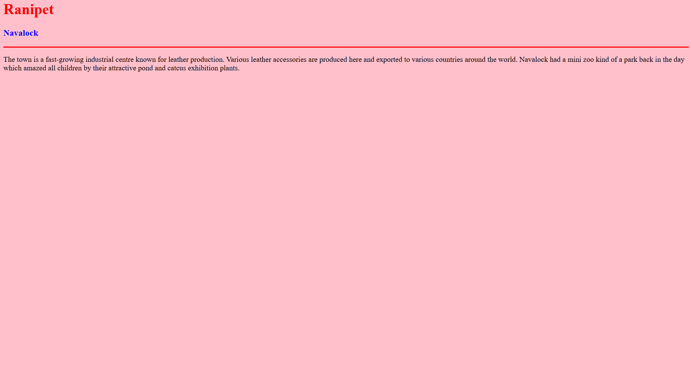

# Ex04 Places Around Me
## Date: 24.11.2024

## AIM
To develop a website to display details about the places around my house.

## DESIGN STEPS

### STEP 1
Create a Django admin interface.

### STEP 2
Download your city map from Google.

### STEP 3
Using ```<map>``` tag name the map.

### STEP 4
Create clickable regions in the image using ```<area>``` tag.

### STEP 5
Write HTML programs for all the regions identified.

### STEP 6
Execute the programs and publish them.

## CODE
```
 map.html
<html>
    <head> 
        <title color="blue">Ranipet</title>
        <h1 color="red" allign="center">Ranipet</h1>
        <h2 allign="center">Indhu Priya.T (24007533) </h2>
    </head>
    <body>
        


        <map name="image-map">
            
            <area target="_blank" alt="" title="Delhi Gate" href="delhigate.html" coords="1223,979,58" shape="circle">
            <area target="_blank" alt="" title="Home" href="home.html" coords="1044,379,1016,434,1072,434" shape="poly">
            <area target="_blank" alt="" title="TMH Factory" href="factory.html" coords="862,216,1081,335" shape="rect">
            <area target="_blank" alt="" title="Friend's House" href="friends.html" coords="437,903,527,900,554,976,447,988,400,956" shape="poly">
            <area target="_blank" alt="" title="Navalock" href="navalock.html" coords="342,821,59" shape="circle">
        </map>
    </body>

</html> 

 delhigate.html
<html>
    <head>
        <title>My Home Town</title>

    </head>
    <body bgcolor="yellow">
        <h1 allign="center">
            <font color="red"> <b> Ranipet</b></font>

        </h1>
        <h3 allign="center">
            <font color="blue"> <b>Delhi Gate </b></font>
        </h3>
        <hr size="3" color="red">
        <p allign="justify">
            <font face="Georgia" size="5"></font>
            Delhi Gate is part of the fortification of Arcot, a town which is located on the banks of Palar river in Ranipet district, Tamil Nadu, India. The gate was part of a fort built by Mughal governor, Daud Khan Panni, in the first half of the 18th century. It was the site of a memorable defense made by Robert Clive during the Siege of Arcot.Historically, the region had been the site of number of battles. This prompted the construction of the fortress around Arcot. The area was captured by a Mughal Nawab of Karnataka from the Marathas caste.[when?][who?] Daud Khan Panni was made governor by Zulfikhar Ali Khan (Aurangzeb's general) in 1698.

            In the year 1710, Mohammed Sayyid was the last mughal governor who was appointed as Nawab of Karnatic with the title Saadatullah Khan I and moved his capital from Gingee to Arcot.
            
            The prolonged disputes between the different dynasties fighting for the control of Arcot led to the arrival of the British and the French. However the battle between British and French forces was only for control of south India. The capture and the defence of Arcot by handful of British troops and Sepoy under the command of Robert Clive against enormous forces was one of the most remarkable battles fought by the British. The siege lasted fifty days, ending 15 November 1751.
            
            The Arcot Fort was part of the famous Battle of Arcot, which led to a British victory. One of the gates of the fort was renamed "Delhi Gate" to signify the beginning of the capture of Delhi. The entrance of the gate was constructed in the style of a Mughal arch. Over the gate is Robert Clives room.
            
            The old red brick town walls which were part of the original fortification of Arcot were destroyed by Tippu Sultan in 1783, but the foundations can be still seen. Today, the remains of the tombs of Saadatullah Khan I and Jama Masjid are the silent witnesses to that period.
        </p>

    </body>
</html>


 home.html

 <html>
    <head>
        <title>My Home Town</title>

    </head>
    <body bgcolor="pink">
        <h1 allign="center">
            <font color="red"> <b> Ranipet</b></font>

        </h1>
        <h3 allign="center">
            <font color="blue"> <b>Home</b></font>
        </h3>
        <hr size="3" color="red">
        <p allign="justify">
            <font face="Georgia" size="5"></font>
        The most highlighted place of my home town will be my home for sure. That was a place which was filled laughter, joy , and many more emotions. Now I am longing to go back there meet all of my friends and again have the time of my life.
            </p>
            

    </body>
</html>

friends.html

<html>
    <head>
        <title>My Home Town</title>

    </head>
    <body bgcolor="cyan">
        <h1 allign="center">
            <font color="red"> <b> Ranipet</b></font>

        </h1>
        <h3 allign="center">
            <font color="blue"> <b>Anna Salai </b></font>
        </h3>
        <hr size="3" color="red">
        <p allign="justify">
            <font face="Georgia" size="5"></font>
           Anna Salai which contains a Anna statue at the end of Arcot bus stand is where most of my school friends live. I always love spending get to gather with, it always feel like my happiest time of the year.
        </p>

    </body>
</html>

navalock.html

<html>
    <head>
        <title>My Home Town</title>

    </head>
    <body bgcolor="pink">
        <h1 allign="center">
            <font color="red"> <b> Ranipet</b></font>

        </h1>
        <h3 allign="center">
            <font color="blue"> <b> Navalock </b></font>
        </h3>
        <hr size="3" color="red">
        <p allign="justify">
            <font face="Georgia" size="5"></font>
            The town is a fast-growing industrial centre known for leather production. Various leather accessories are produced here and exported to various countries around the world. Navalock had a mini zoo kind of a park back in the day which amazed all children by their attractive pond and catcus exhibition plants.
        </p>

    </body>
</html>

factory.html
<html>
    <head>
        <title>My Home Town</title>

    </head>
    <body bgcolor="yellow">
        <h1 allign="center">
            <font color="red"> <b> Ranipet</b></font>

        </h1>
        <h3 allign="center">
            <font color="blue"> <b>TMH Factory </b></font>
        </h3>
        <hr size="3" color="red">
        <p allign="justify">
            <font face="Georgia" size="5"></font>
            TCL takes great pride in manufacturing products that enhance people’s everyday lives. Their diverse range of offerings caters to industries such as plastics, paints, food, cosmetics, and pharmaceuticals. With cutting-edge production facilities, we ensure timely delivery and efficient logistics, earning a reputation for excellence and dependability.

TCL upholds safety, integrity, and the well-being of its employees and stakeholders as core values. TCL products are certified, guaranteeing adherence to the highest health and safety standards. We are dedicated to being responsible members of the communities in which we operate, actively engaging with and positively contributing to them.

Integrity is the foundation of their  business, and TCL believe in emonstrating it through its actions and maintaining transparent relationships with our customers, partners, investors, and employees.

TCL is committed to environmental sustainability, implementing industry-leading initiatives that have a positive impact on the communities we serve.
        </p>

    </body>
</html>
```


## OUTPUT





## RESULT
The program for implementing image maps using HTML is executed successfully.
 